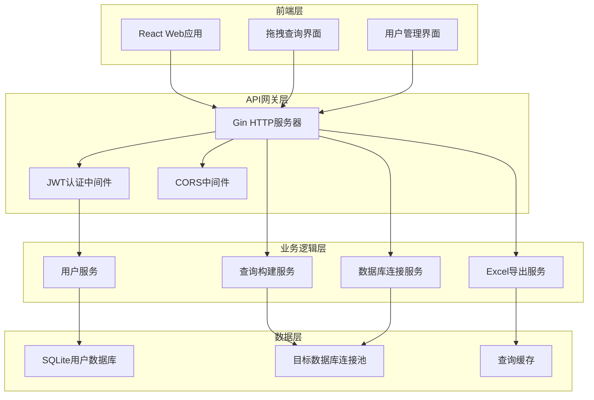

# 设计文档

## 概述

可视化数据库查询系统采用前后端分离的架构，使用Go语言构建RESTful API后端，React构建交互式前端界面。系统支持多种数据库连接，提供直观的拖拽查询界面，并具备完整的用户认证和权限管理功能。

## 架构

### 整体架构



### 技术栈

**后端技术栈:**
- **Go 1.21+**: 主要编程语言
- **Gin**: Web框架，提供HTTP路由和中间件
- **GORM**: ORM框架，简化数据库操作
- **SQLite**: 用户数据存储和演示数据
- **JWT-Go**: JSON Web Token认证
- **Excelize**: Excel文件生成
- **database/sql**: 通用数据库驱动接口

**前端技术栈:**
- **React 18**: 用户界面框架
- **TypeScript**: 类型安全的JavaScript
- **React DnD**: 拖拽功能实现
- **Ant Design**: UI组件库
- **Axios**: HTTP客户端
- **React Query**: 数据获取和缓存

## 组件和接口

### 后端API接口

#### 认证接口
```go
// POST /api/auth/login
type LoginRequest struct {
    Username string `json:"username" binding:"required"`
    Password string `json:"password" binding:"required"`
}

type LoginResponse struct {
    Token     string    `json:"token"`
    ExpiresAt time.Time `json:"expires_at"`
    User      UserInfo  `json:"user"`
}

// POST /api/auth/register (仅管理员)
type RegisterRequest struct {
    Username string `json:"username" binding:"required"`
    Password string `json:"password" binding:"required"`
    Role     string `json:"role" binding:"required"`
}
```

#### 数据库连接接口
```go
// GET /api/databases
type DatabaseInfo struct {
    ID     string            `json:"id"`
    Name   string            `json:"name"`
    Type   string            `json:"type"`
    Tables []TableInfo       `json:"tables"`
}

// GET /api/databases/{id}/tables
type TableInfo struct {
    Name    string      `json:"name"`
    Columns []ColumnInfo `json:"columns"`
}

type ColumnInfo struct {
    Name     string `json:"name"`
    Type     string `json:"type"`
    Nullable bool   `json:"nullable"`
}
```

#### 查询接口
```go
// POST /api/query/build
type QueryRequest struct {
    DatabaseID string           `json:"database_id"`
    Tables     []string         `json:"tables"`
    Columns    []ColumnSelect   `json:"columns"`
    Conditions []QueryCondition `json:"conditions"`
    OrderBy    []OrderByClause  `json:"order_by"`
    Limit      int              `json:"limit"`
}

type QueryResponse struct {
    SQL     string              `json:"sql"`
    Columns []string            `json:"columns"`
    Data    []map[string]interface{} `json:"data"`
    Total   int                 `json:"total"`
}

// POST /api/query/export
type ExportRequest struct {
    QueryRequest
    Format string `json:"format"` // "excel"
}
```

### 前端组件架构

#### 主要组件
```typescript
// 应用根组件
interface App {
  authentication: AuthenticationState
  routing: RouterState
}

// 查询构建器组件
interface QueryBuilder {
  databaseSelector: DatabaseSelector
  tableExplorer: TableExplorer
  queryCanvas: QueryCanvas
  conditionBuilder: ConditionBuilder
  resultPreview: ResultPreview
}

// 拖拽组件
interface DragDropComponents {
  DraggableColumn: React.FC<{column: ColumnInfo}>
  DroppableArea: React.FC<{onDrop: (item: any) => void}>
  QueryCanvas: React.FC<{query: QueryState}>
}
```

## 数据模型

### 用户管理数据模型

```go
// 用户表
type User struct {
    ID        uint      `gorm:"primaryKey"`
    Username  string    `gorm:"unique;not null"`
    Password  string    `gorm:"not null"` // bcrypt哈希
    Role      string    `gorm:"not null"` // "admin" 或 "user"
    CreatedAt time.Time
    UpdatedAt time.Time
}

// 数据库连接配置
type DatabaseConnection struct {
    ID       string `gorm:"primaryKey"`
    Name     string `gorm:"not null"`
    Type     string `gorm:"not null"` // "sqlite", "mysql", "postgres"
    Host     string
    Port     int
    Database string
    Username string
    Password string `gorm:"-"` // 不存储在数据库中，运行时配置
    CreatedAt time.Time
}

// 查询历史
type QueryHistory struct {
    ID         uint      `gorm:"primaryKey"`
    UserID     uint      `gorm:"not null"`
    DatabaseID string    `gorm:"not null"`
    QueryJSON  string    `gorm:"type:text"` // JSON格式的查询配置
    SQL        string    `gorm:"type:text"`
    CreatedAt  time.Time
    User       User      `gorm:"foreignKey:UserID"`
}
```

### 查询构建数据模型

```typescript
// 前端查询状态
interface QueryState {
  databaseId: string
  selectedTables: string[]
  selectedColumns: ColumnSelect[]
  conditions: QueryCondition[]
  orderBy: OrderByClause[]
  limit: number
  preview: QueryResult | null
}

interface ColumnSelect {
  table: string
  column: string
  alias?: string
  aggregation?: 'COUNT' | 'SUM' | 'AVG' | 'MAX' | 'MIN'
}

interface QueryCondition {
  column: string
  operator: 'eq' | 'ne' | 'gt' | 'lt' | 'gte' | 'lte' | 'like' | 'in'
  value: any
  logicalOperator?: 'AND' | 'OR'
}
```

## 错误处理

### 后端错误处理策略

```go
// 统一错误响应格式
type ErrorResponse struct {
    Code    int    `json:"code"`
    Message string `json:"message"`
    Details string `json:"details,omitempty"`
}

// 错误类型定义
var (
    ErrUnauthorized     = errors.New("unauthorized access")
    ErrInvalidQuery     = errors.New("invalid query configuration")
    ErrDatabaseConnect  = errors.New("database connection failed")
    ErrQueryExecution   = errors.New("query execution failed")
    ErrExportGeneration = errors.New("export file generation failed")
)

// 中间件错误处理
func ErrorHandler() gin.HandlerFunc {
    return func(c *gin.Context) {
        c.Next()
        
        if len(c.Errors) > 0 {
            err := c.Errors.Last()
            // 根据错误类型返回适当的HTTP状态码和错误信息
        }
    }
}
```

### 前端错误处理

```typescript
// 错误边界组件
class ErrorBoundary extends React.Component {
  // 捕获组件渲染错误
}

// API错误处理
const apiClient = axios.create({
  interceptors: {
    response: {
      error: (error) => {
        // 统一处理API错误
        // 显示用户友好的错误信息
        // 记录错误日志
      }
    }
  }
})
```

## 测试策略

### 后端测试

**单元测试:**
- 使用Go内置testing包
- 测试覆盖率目标: 80%+
- 重点测试业务逻辑和数据转换

**集成测试:**
- 使用testify库进行断言
- 测试API端点的完整流程
- 使用内存SQLite进行数据库测试

**测试结构:**
```go
func TestUserService_CreateUser(t *testing.T) {
    // 准备测试数据
    // 执行测试
    // 验证结果
}

func TestQueryBuilder_BuildSQL(t *testing.T) {
    // 测试SQL生成逻辑
}
```

### 前端测试

**单元测试:**
- 使用Jest + React Testing Library
- 测试组件渲染和用户交互
- 测试业务逻辑函数

**集成测试:**
- 使用Cypress进行端到端测试
- 测试完整的用户工作流程
- 测试拖拽功能和查询构建

**测试示例:**
```typescript
describe('QueryBuilder', () => {
  test('should add column when dragged to canvas', () => {
    // 测试拖拽功能
  })
  
  test('should generate correct query preview', () => {
    // 测试查询预览
  })
})
```

### 性能测试

**后端性能:**
- 使用Go benchmark测试
- 测试查询执行性能
- 测试并发用户场景

**前端性能:**
- 使用Lighthouse进行性能审计
- 测试大数据集的渲染性能
- 优化拖拽操作的响应时间

## 安全考虑

### 认证和授权
- JWT token过期时间设置为24小时
- 密码使用bcrypt加密存储
- 实施角色基础访问控制(RBAC)

### SQL注入防护
- 使用参数化查询
- 输入验证和清理
- 查询复杂度限制

### 数据保护
- HTTPS强制加密传输
- 敏感数据不记录日志
- 数据库连接信息加密存储

## 部署架构

### 开发环境
```yaml
# docker-compose.yml
version: '3.8'
services:
  backend:
    build: ./backend
    ports:
      - "8080:8080"
    volumes:
      - ./data:/app/data
  
  frontend:
    build: ./frontend
    ports:
      - "3000:3000"
    depends_on:
      - backend
```

### 生产环境考虑
- 使用反向代理(Nginx)
- 数据库连接池配置
- 日志聚合和监控
- 自动备份策略